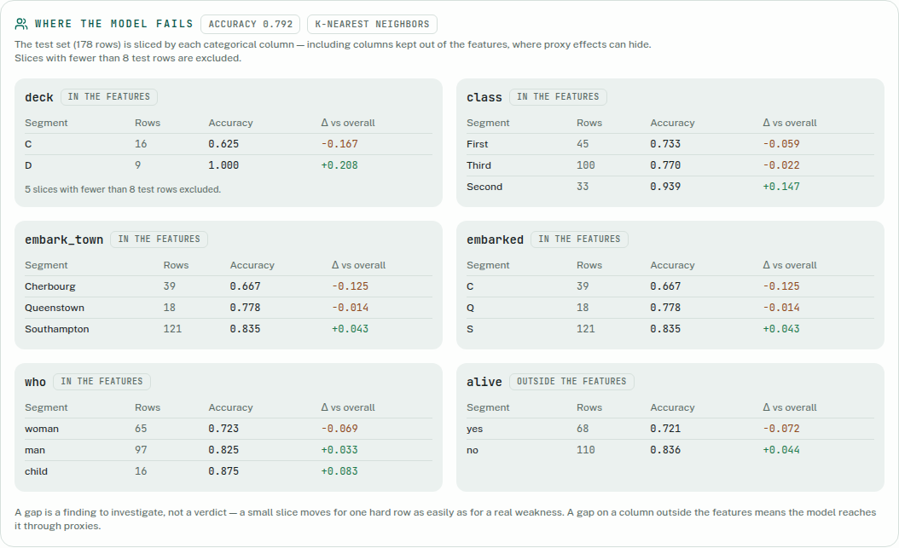
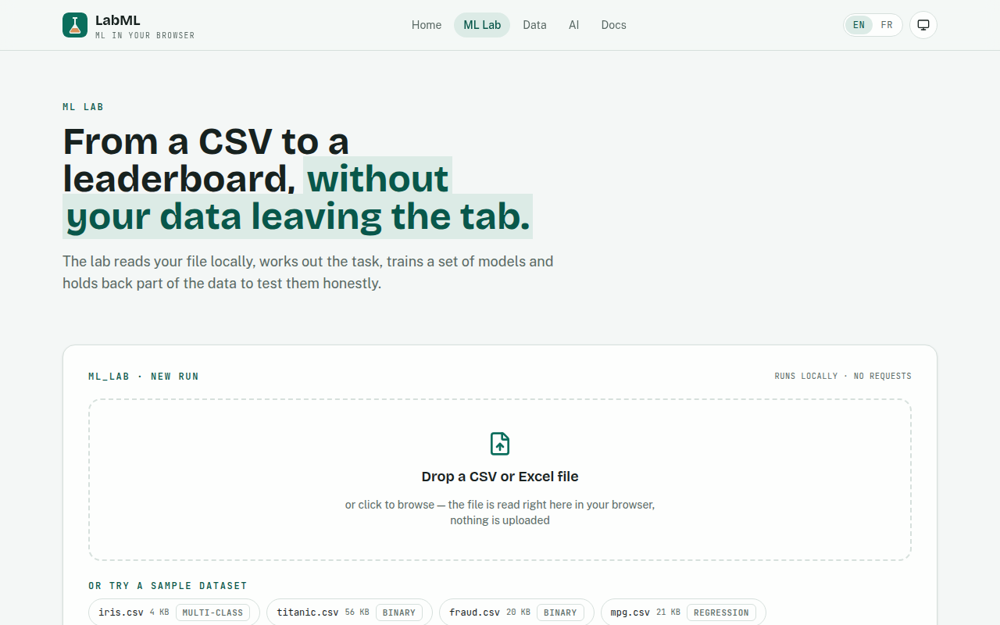
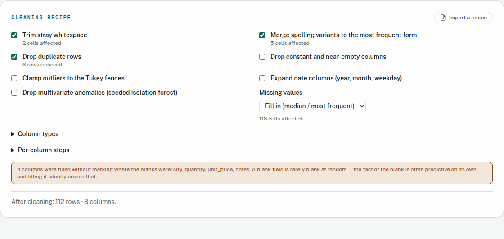
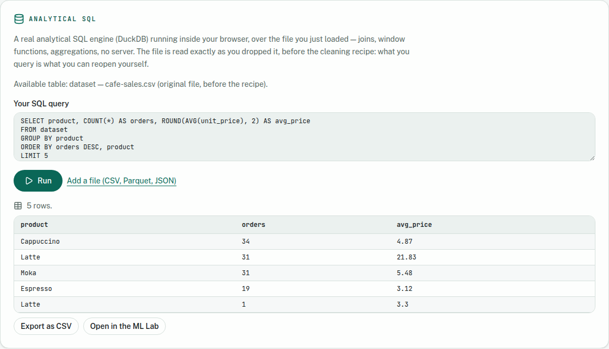
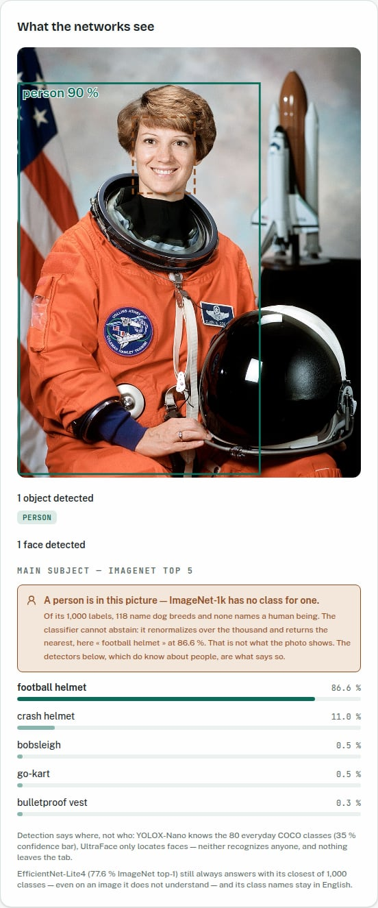
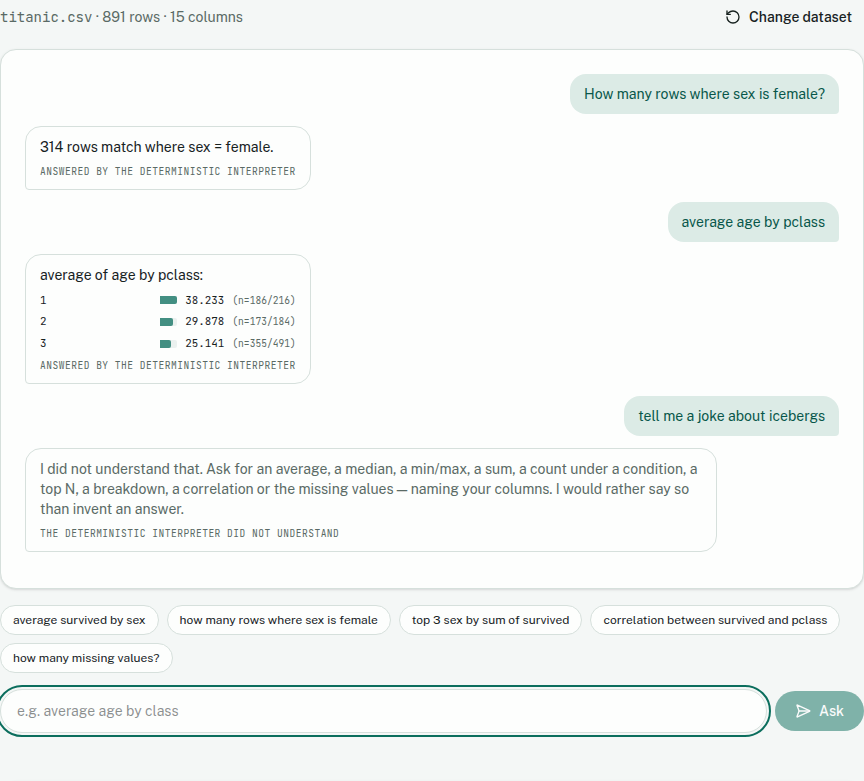

# LabML

**A complete machine learning lab that runs entirely in your browser.** Drop a CSV, audit and
clean it, train and compare models, understand where they fail, and score new data — your
dataset never leaves your machine.

**Live at [app.dominicdapice.com](https://app.dominicdapice.com)** · MIT licensed · Built by
[Dominic D'Apice](https://dominicdapice.com)

**More about this project → [LabML — ML in Your Browser: a Complete Machine Learning Lab With
No Backend](https://dominicdapice.com/portfolio/labml-ml-in-your-browser/)** — an 11-minute
write-up of the bet behind the project and how each section works. Available in English and
French.

---

## The ML Lab in one run

Drop `titanic.csv`, pick a column to predict, press train. Eight model families train **in your
own browser** — the naive baseline among them — and an ensemble of the top three joins the
ranking for free, since its members are already fitted. Every model is **selected on a
validation split and reported on a third split it never touched**, with the gap between the two
spelled out: here the winner is picked at 0.818 and scores 0.792, and the page says so.


---

## Overview

LabML is a privacy-first, offline-capable web application covering the full tabular ML
workflow — data quality, training, evaluation, explanation, and reuse — with **no backend, no
accounts, and no uploads**. Every computation (parsing, cleaning, training, inference) runs in
Web Workers on the user's own machine.

The project follows three non-negotiable principles:

- **Privacy by architecture.** A strict Content-Security-Policy allows zero third-party
  calls. Data lives in worker memory; persistence (run history, opted-in datasets) uses
  IndexedDB locally; share links carry metrics in the URL fragment, which browsers never
  send to any server. `/privacy` states this in plain language and hands the reader a
  four-step protocol to verify it in their own DevTools — the policy quoted there is
  pinned to the served header by a unit test, so the page cannot claim a protection the
  site stopped shipping.
- **Honest evaluation.** Every run is scored against a naive baseline on a held-out test
  set. Models are **selected on a validation split and reported on a third, never-selected
  test split**, with the gap between the two shown — crowning the best of nine on the
  reporting set is what makes a headline figure optimistic. Metrics ship with 95% bootstrap
  intervals, per-segment breakdowns, calibration curves, and explicit refusals when a number
  would be noise (tiny slices, tiny test sets, a model whose probabilities are saturated).
  **The ranking metric is yours to pick** — accuracy rewards always answering the majority
  class, so on an imbalanced target you rank on F1 or recall instead, and the order changes.
- **Hand-written, deterministic ML.** The model zoo, search, explanations, and statistics
  are implemented from scratch in TypeScript, seeded end to end — the same seed always
  reproduces the same run.

## Features

### ML Lab — `/ml`

| Area           | What it does                                                                                                                                                                                                                                                                                                                                                                                                                                                                                              |
| -------------- | --------------------------------------------------------------------------------------------------------------------------------------------------------------------------------------------------------------------------------------------------------------------------------------------------------------------------------------------------------------------------------------------------------------------------------------------------------------------------------------------------------- |
| Data in        | Drag & drop CSV/Excel (parsed in a worker), demo datasets, per-column profiling, automatic task detection, smart exclusions and **target-leakage detection**; **a French export reads correctly** — encoding settled by decoding and failing (not sniffing), delimiter and decimal separator detected per column and announced with the count that proved them; **free-text columns** join the pipeline as hand-written TF-IDF (FR/EN tokenization, capped vocabulary, fitted on the training split only) |
| Models         | 8 classifiers / 7 regressors trained live: naive baseline, linear/logistic regression, k-NN, Gaussian Naive Bayes, decision tree, random forest, **hand-written histogram gradient boosting** (LightGBM-style) and **MLP** (seeded He init, Adam)                                                                                                                                                                                                                                                         |
| Leaderboard    | Accuracy/F1/ROC-AUC/log-loss or RMSE/MAE/R², delta vs baseline, train time, inference latency p50/p95, **95% bootstrap intervals** with a paired winner-vs-baseline verdict                                                                                                                                                                                                                                                                                                                               |
| Understanding  | Confusion matrix, ROC, permutation importance, partial dependence, live what-if with **exact Shapley explanations**, **signed word effects** for text columns (which words push the answer up or down), plain-language read (FR/EN, rule-generated)                                                                                                                                                                                                                                                       |
| Where it fails | **Per-segment analysis**: the test set sliced by every categorical column — including excluded ones, where proxy effects hide — worst gaps first                                                                                                                                                                                                                                                                                                                                                          |
| Imbalance      | Precision-recall curve (AP), calibration curve (Brier), **cost-priced decision threshold** with the optimal cut computed by exhaustive sweep                                                                                                                                                                                                                                                                                                                                                              |
| Tuning         | Seeded random search scored by stratified 3-fold cross-validation, pipeline refitted inside each fold — the test set is scored exactly once                                                                                                                                                                                                                                                                                                                                                               |
| More data?     | **Learning curve** on demand: one model retrained on growing seeded nested fractions, 95% bootstrap band, plain verdict — still climbing (collect more rows) or flattened (work on features) — including whether an announced training cap costs accuracy                                                                                                                                                                                                                                                 |
| No target?     | Seeded k-means (k chosen by silhouette) + power-iteration PCA projection, groups described in plain language; date column? **Holt-Winters forecasting** validated by rolling-origin backtest                                                                                                                                                                                                                                                                                                              |
| MLOps loop     | Score a **new batch** with honest test-vs-batch metrics; **compare two runs** side by side with cross-run uncertainty verdicts, or **up to six at once** read against the oldest of the selection; **export a model as JSON and re-import it later** — the exact predictor is rebuilt (byte-identical predictions) and scores any CSV without retraining                                                                                                                                                  |
| Speed          | Heavy families train on **helper cores** (announced on the leaderboard, split by measured cost, never silent), and a model crosses back as JSON so it is rebuilt through the same path an imported model uses. Measured on a 60 000-row run: **74 s → 9.5 s**, with every leaderboard number identical                                                                                                                                                                                                    |
| Persistence    | Local run history with attached artifacts, opted-in dataset storage (compressed, explicit 50 MB budget), self-contained HTML reports, data-free share links                                                                                                                                                                                                                                                                                                                                               |

**What the run gives you, past the ranking:**

|                                                                                                                                                                   |                                                                                                               |
| ----------------------------------------------------------------------------------------------------------------------------------------------------------------- | ------------------------------------------------------------------------------------------------------------- |
| [](docs/screenshots/segments.png)                                                                          | [](docs/screenshots/ml-lab.png)                                 |
| **Where it fails** — the test set sliced by every categorical column, worst gaps first, including columns kept **out** of the features, where proxy effects hide. | **Starting point** — drop a file or take a sample dataset. The file is read in a worker; nothing is uploaded. |


_Every figure above was produced by the app itself, on the `titanic.csv` sample, seed 42 —
reproducible by pressing train._

LIMITATION: The ideal dataset size is between 1MB and 30MB; beyond 30 MB, the browser response time may take longer to return the results.

### Data Studio — `/data`

- **Quality report** with a deterministic 0–100 score: missing cells, duplicates,
  case/whitespace variants, Tukey-fence outliers, constant/near-empty/id columns.
- **Replayable cleaning recipe** — trim, merge variants, deduplicate, impute, clamp
  outliers, force column types, expand dates — exportable as JSON and re-runnable on new
  files, with a seeded **isolation-forest anomaly step** for multivariate outliers.
- **Per-column steps**: the file-wide settings are defaults a column may override —
  median, mean, most-frequent, a constant, or a « MANQUANT » category. Every imputed
  column can add a `<column>_absent` **missing indicator**, written before anything is
  filled; columns filled _without_ one are named out loud, because a blank field is
  rarely blank at random and filling it silently erases that.
- **Validity rules**: a value can be present, correctly typed and still impossible — an
  age of 200, a date in the future, a percentage at 130, a malformed postcode. Plus
  **cross-column consistency**: an end date before its start, a total that is not
  quantity × price. Every rule fires on evidence rather than on a column's name, and
  reports without ever repairing — the recipe is where data changes.
- **The quality score, broken into its parts**: each with its weight, what it found and
  what it cost, instead of a number asserted without explanation.
- **An auditable before/after diff** of what the recipe did — which rows, which columns,
  which values — and a **replayable reference profile** (bin edges and shares, never
  rows) so a new file can be checked for drift against a snapshot you no longer hold.
- **Left-join a second file** on a shared key: match rate, duplicates and orphans are
  named, never silent; the joined result becomes the working dataset.
- **Drift check**: compare a new batch against the reference — schema diff, PSI per
  column, new/vanished categories, severity verdict on conventional thresholds.
- One-click hand-off to the ML Lab.


|                                                                                                                                                                                      |                                                                                                                                                                                                                    |
| ------------------------------------------------------------------------------------------------------------------------------------------------------------------------------------ | ------------------------------------------------------------------------------------------------------------------------------------------------------------------------------------------------------------------ |
| [](docs/screenshots/data-recipe.png)                                                                                         | [](docs/screenshots/data-sql.png)                                                                                                                |
| **The recipe** — every step counts what it changed, and the panel names the four columns it filled **without** a missing indicator, because a blank field is rarely blank at random. | **DuckDB, in the tab** — a real `GROUP BY` over the file exactly as it was dropped, _before_ the recipe: both spellings of `Latte` and the average the outliers inflate are still there, which is the whole point. |

### Documentation — `/docs`

- Markdown committed to the repository (`src/content/docs/<lang>/*.md`) and compiled at
  build time on the **Diátaxis** split, with a local search index — no parser and no
  third-party documentation host ever reaches the browser. **Every figure a page quotes
  is asserted against the running app** (`e2e/docs.spec.ts`): a page that drifts breaks
  the build. Quoting a wall-clock duration is forbidden by its own test, because two
  identical runs agree on every metric and disagree on every timing. « Try it » links
  are deep links (`/ml?demo=titanic&target=survived`) rather than screenshots, so they
  cannot go stale unnoticed.
- **The table of refusals** (`/docs/refus`): every named refusal the app can raise —
  what triggers it, what it means, what to do — **extracted from the source, not
  written from memory**. A test re-extracts it on every run in both directions: a code
  thrown but undocumented fails the build, and so does a documented code the app no
  longer throws. Refusing well is this project's distinguishing feature; a refusal
  nobody can decode reads as a bug instead of the decision it is.
- **What LabML does not do** (`/docs/limites`): the features set aside, the ones dropped
  after measurement, and **the predictions measurement refuted** — extracted from the
  engineering log rather than recalled, because memory flatters. A guard traces each
  figure back to the entry that recorded it. Twelve pages per language span all four
  Diátaxis quadrants, and a test asserts every one of them ends with a working next
  step: documentation without one is a dead end.


_The index is built at compile time and queried in the tab — typing here sends nothing._

### AI Playground — `/ai`

- **Vision** (`/ai/vision`): on-device image analysis on ONNX Runtime Web (WebAssembly)
  with three self-hosted models — **EfficientNet-Lite4** classification (1,000 ImageNet
  classes, 77.6% top-1), **YOLOX-Nano** object detection (80 COCO classes) and
  **UltraFace** face detection — boxes drawn on the image, hand-written and unit-tested
  box decoding (grids, IoU, NMS), webcam supported; the photo never leaves the browser.
  It also **says when it cannot answer**: ImageNet-1k has 1,000 labels, 118 of them dog
  breeds and none for a human being, so a photo of someone comes back as « football
  helmet » at 86.6% — confidently, because a softmax cannot abstain. When the two
  detectors agree a person is in frame, or when the top class falls below 50%, the page
  says so and keeps the label visible rather than presenting it as the answer. Measured
  on a 14-image bench replayed in the real browser (`e2e/vision-bench.spec.ts`): all four
  images ImageNet cannot name are refused, the one wrong label is announced as wrong, and
  no correct answer is lost.
- **Analytical SQL** (`/data`): a real OLAP engine — DuckDB-Wasm, MIT, self-hosted and
  single-threaded — queries the loaded file in the browser, plus any CSV, **Parquet** or
  JSON attached in the session. Results export to CSV or move to the ML Lab in one click;
  SQL errors show DuckDB's own message. The engine is pinned to 1.28.0 for a measured
  reason: from 1.29 its binaries exceed Cloudflare's 25 MiB per-file limit.
- **Data assistant** (`/ai/chat`): plain French or English questions about a loaded
  dataset (averages, counts, top-N, correlations…) answered by a deterministic local
  interpreter — when it does not understand, it says so. It only claims to understand
  once it has read the **whole** question: a word it cannot account for is a refusal, not
  an answer to a shorter question. A **real local language model** (Qwen3-0.6B, 355 MB,
  Apache-2.0, self-hosted and split into 24 MiB parts to clear Cloudflare's limit) can be
  downloaded on explicit consent to read free-form phrasings: it only _translates_ the
  question into a query — the deterministic engine still computes every number, and a
  badge under each answer names which engine produced it. The translation is decoded
  **inside** the query grammar: a hand-written logits processor masks, at every token,
  everything that would leave the grammar, so an invented column, an operator that does
  not exist or a category the column does not hold cannot be written in the first place.
  One shape stays reachable on purpose — `{"kind":"none"}`, the model's way of saying it
  cannot express the question — because forcing a valid answer turns a refusal into a
  wrong number. The reading of all 55 reference questions is measured, not asserted: see
  **Measuring the assistant** below. WebGPU required; without it the refusal is named and
  the deterministic interpreter stays fully available.


|                                                                                                                                                                                                        |                                                                                                                                                                                         |
| ------------------------------------------------------------------------------------------------------------------------------------------------------------------------------------------------------ | --------------------------------------------------------------------------------------------------------------------------------------------------------------------------------------- |
| [](docs/screenshots/ai-vision-refusal.jpg)                                                                                  | [](docs/screenshots/ai-chat.png)                                                                              |
| **Saying « I cannot »** — the detectors find a person; ImageNet-1k has no class for one, so the top label (« football helmet », 86.6%) stays on screen and is announced as _not_ what the photo shows. | **The assistant, both ways** — two questions answered with the engine that produced each named underneath, and a third refused rather than invented. Nothing but the browser was asked. |

_Both photos ship with the repository's vision bench: the school bus is CC BY 2.0 (Fahim Fadz.,
Wikimedia Commons), the portrait is NASA, public domain._

## Engineering notes

- **Everything off the main thread.** Parsing, cleaning, training, scoring and analysis
  run in dedicated Web Workers behind typed message protocols.
- **From-scratch algorithms**, unit-tested against known results: gradient boosting
  (quantile bins, second-order gains, Newton leaves), MLP, k-means++, PCA, Holt-Winters,
  isolation forest, PSI, Shapley values, bootstrap intervals, PR/ROC/calibration curves,
  TF-IDF (bilingual tokenizer, smoothed IDF, L2-normalized vectors), and detection
  post-processing (YOLOX grid decode, IoU, non-maximum suppression).
- **Leakage discipline.** Preprocessing (imputation, one-hot/ordinal encoding,
  standardization) is fitted on the training split only; cross-validation refits the
  pipeline inside each fold; forecast backtests never peek at the future. Dated files can
  be split **chronologically** and grouped files **by group**, both announced — a random
  split puts the future in training. A one-column stump flags any lone column that predicts
  the target at 99%: that is a leak warning, never a victory.
- **Determinism.** A single seed drives splits, model initialization, search, sampling
  and resampling — runs are exactly reproducible, and the test suite depends on it.
- **Scale, honestly.** 100k–1M-row files train comfortably: past 100 000 usable rows an
  **announced** seeded stratified sample takes over (never silent — the leaderboard says
  so), slow model families train on measured, announced caps scored against the same
  full test set, and parsing refuses past a named 20M-cell memory budget instead of
  letting the tab die.
- **Performance.** Every section serves a prerendered static shell (hero paints before
  JavaScript); Lighthouse mobile ≈ 0.99 on `/ml` under real throttling. Heavy
  dependencies (Dexie, SheetJS, ONNX Runtime) load lazily.
- **Quality bar.** 711 unit tests and 111 Playwright end-to-end tests across three browser
  projects — desktop, a phone viewport, and dark mode — covering offline PWA, a fake
  webcam, a horizontal-overflow guard on every route, and axe-core WCAG A/AA checks on
  every page including the twenty-four documentation pages. Plus strict TypeScript,
  ESLint, Prettier, and Lighthouse budgets — all enforced in CI.
- **One dependency does not come from npm.** SheetJS left the registry, and the copy
  still published there (`xlsx@0.18.5`) carries two unfixable high advisories. The
  dependency points at the project's official tarball instead, which fixes both;
  `package-lock.json` pins its integrity hash, so a tampered download fails `npm ci`
  rather than shipping. It is still fetched at install time and bundled — the browser
  calls nobody.

## Tech stack

React 19 · TypeScript (strict) · Vite · Tailwind CSS v4 · react-router · zustand ·
i18next (bilingual EN/FR) · Dexie (IndexedDB) · Papa Parse · SheetJS · ONNX Runtime Web ·
DuckDB-Wasm · Transformers.js · Vitest + Testing Library · Playwright · GitHub Actions ·
Cloudflare Pages

## Getting started

Requires Node 20+.

```bash
npm ci             # install dependencies
npm run dev        # start the dev server
```

| Script                                  | Purpose                            |
| --------------------------------------- | ---------------------------------- |
| `npm run test`                          | Unit tests (Vitest)                |
| `npm run e2e`                           | End-to-end tests (Playwright)      |
| `npm run typecheck`                     | TypeScript, strict mode            |
| `npm run lint` / `npm run format:check` | ESLint / Prettier                  |
| `npm run build`                         | Production build to `dist/`        |
| `npm run preview`                       | Serve the production build locally |
| `npm run llm:prepare`                   | Fetch and split the local LLM      |

The language model behind the data assistant is **not committed** (355 MB). `npm run
llm:prepare` downloads it into `public/llm/` and splits it into parts under Cloudflare's
25 MiB per-file limit; CI runs it before the production build. Skip it and everything
else works — the assistant simply falls back to its deterministic interpreter, which is
the default in any case.

### Measuring the assistant

`src/features/ai/llm/corpus.ts` holds **55 reference questions**, French and English,
across every shape of the query grammar plus three that no query can answer — where
refusing is the only correct outcome. Two harnesses run the same corpus:

| Command                                                       | Needs                             | Measures                                                        |
| ------------------------------------------------------------- | --------------------------------- | --------------------------------------------------------------- |
| `npm run test` (`corpus.test.ts`)                             | nothing                           | the deterministic parser, the grammar automaton, the token mask |
| `npm run llm:fetch && npm run llm:bench:node`                 | 355 MB on disk, a few CPU minutes | the real model, end to end                                      |
| `V27_BENCH=1 npm run build && node scripts/run-llm-bench.mjs` | a GPU with `shader-f16`           | the same, on the shipped WebGPU runtime                         |

The CI half runs on every commit and asserts the number that matters most: the
deterministic parser produces **zero wrong answers** on the corpus. The model half is a
separate on-demand workflow (`.github/workflows/llm-bench.yml`) — it downloads 355 MB and
takes minutes, which is not a cost worth adding to every pull request.

The bench takes the model as a parameter, which is how « would a bigger model read
better? » stops being an opinion:

```
LABML_LLM_REPO=onnx-community/Qwen3-1.7B-ONNX npm run llm:bench:node
```

Measured on the same 55 questions: **Qwen3-1.7B (1.43 GB, four times the download)
scores worse** — 40 right / 12 wrong against 42 / 7 for the 355 MB model that ships. It
reads the grouped comparisons a small model refuses, and misreads simple counts. The
prompt was tuned against the small model, so that number is a property of the pair, not
of the model; see PLAN.md § N for the full result and its limits.

## Deployment

CI builds, tests and deploys on every push: pull requests get a Cloudflare Pages preview,
`main` deploys to production. Required repository secrets: `CLOUDFLARE_API_TOKEN` and
`CLOUDFLARE_ACCOUNT_ID` — see [docs/guide-cloudflare.md](docs/guide-cloudflare.md).

## Roadmap

Development proceeds in planned "caps" of feature waves; six caps have shipped (MVP
through the lab meeting the real world — real photos, real text, real file sizes). The full plan, delivery log and design decisions live in
[PLAN.md](PLAN.md).

## License

[MIT](LICENSE) © Dominic D'Apice

Redistributed third-party material — the vision and language models, the self-hosted
WebAssembly runtimes, and the demo datasets — is attributed in [NOTICE](NOTICE).
